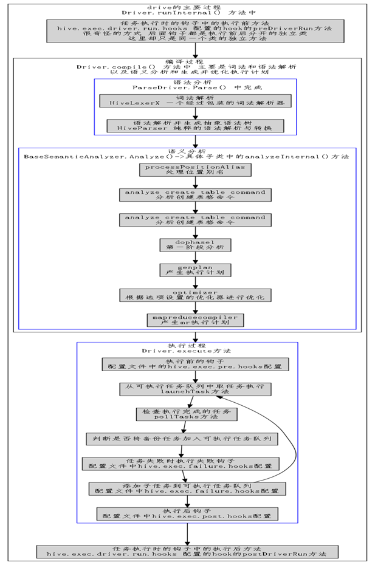
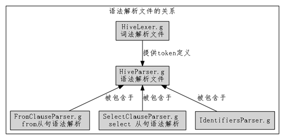
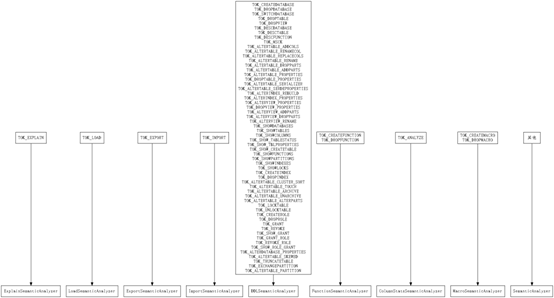

                   hive词法语法解析分析（md版格式已乱，请参阅docx版）

  

[第一章         前言... 1](#_Toc368316516)

[第二章         准备工作... 1](#_Toc368316517)

[第三章         总体概览... 3](#_Toc368316518)

[第一节      hive官方架构图... 3](#_Toc368316519)

[第二节     流程处理图... 3](#_Toc368316520)

[第三节     具体框架图... 5](#_Toc368316521)

[第四章         语法分析... 5](#_Toc368316522)

[第一节     快速定位词法语法分析的位置的常用方法... 5](#_Toc368316523)

[第二节     语法文件之间的关系... 7](#_Toc368316524)

[第三节     静态分析语法文件的方法... 8](#_Toc368316525)

[第四节     动态分析语法文件的方法... 13](#_Toc368316526)

[第五章         语义分析阶段... 15](#_Toc368316527)

[第一节     语义处理模块的关系... 16](#_Toc368316528)

 

第一章         前言
-------------------

   我们知道 hive是一个基于hadoop上面提供了类sql的接口的组件，以方便熟悉sql的人使用hadoop，对大数据的处理。限于精力，本文只关注hive所提供的语法，它解析语法的过程，以及生成执行计划和优化这几个过程。

 

第二章         准备工作
-----------------------

分析对象:hive源代码，版本Revision 1522497

需要用到的工具： svn ant  antlr-3.5-complete.jar，antlrworks-1.4.2.jar，eclipse。

注：在http://www.antlr3.org/download.html  可以下载antlr-3.5-complete.jar，antlrworks-1.4.2.jar.

hive中使用到的antlr是 v3.4版本的，使用v3.5没有问题，但请别使用v4.0的。

 

 

下载源代码,并编译

svn co http://svn.apache.org/repos/asf/hive/trunk hive

cd hive

~~~~ {style="background:white"}
ant clean package eclipse-files
~~~~

最后一个是为了方便导入成eclipse项目，有些人是喜欢用eclipse查看源代码。

 

第三章         总体概览
-----------------------

### 第一节         hive官方架构图

摘自 hadoop 权威指南

 

### 第二节         流程处理图

  

这张图是从源代码中剥茧抽丝的出来的抽象，忽略掉了无关紧要的细节。

这张图描述了 hive从解析语句到执行的过程。 后续的内容会以为大纲详细展开。

### 第三节         具体框架图

(待完善)

 

第四章         语法分析
-----------------------

### 第一节         快速定位词法语法分析的位置的常用方法

搜索 .g的位置

find ./ -name "\*.g"

会得到

./ql/src/java/org/apache/hadoop/hive/ql/parse/FromClauseParser.g

./ql/src/java/org/apache/hadoop/hive/ql/parse/SelectClauseParser.g

./ql/src/java/org/apache/hadoop/hive/ql/parse/HiveParser.g

./ql/src/java/org/apache/hadoop/hive/ql/parse/IdentifiersParser.g

./ql/src/java/org/apache/hadoop/hive/ql/parse/HiveLexer.g

./metastore/src/java/org/apache/hadoop/hive/metastore/parser/Filter.g

基本可以确定了 ql下面就是需要找到东西。

find . -name "\*.java" |xargs grep "HiveLexer "

找到两处

./build/ql/gen/antlr/gen-java/org/apache/hadoop/hive/ql/parse/HiveLexer.java:public class HiveLexer extends Lexer {

./ql/src/java/org/apache/hadoop/hive/ql/parse/ParseDriver.java:  public class HiveLexerX extends HiveLexer {

 

其中第一处是编译期构建的， 而另外一处是包装了该类。重点可以放到第二处。也即parseDriver类。

 

对parseDriver类做一个大致的分析，

包装了antlr的antlrStringStream 成为antlrnocasestream。消除了大小写敏感。

包装了词法解析器 HiveLexer，主要是包装了出错信息。

包装了抽象树节点，主要聚合了ASTNodeOrigin 以求能获得对象类型，名字，定义，别名，和定义。

其中parser方法是我们重点关注的，它调用词法解析和语法解析。

察看其所有的调用者的关系形成的路径，找到一条通向cli的包的clidriver类main方法，（可以通过eclipse的北调用关系反向查看）

clidriver.run() -\>clidriver.executeDriver()-\>clidriver.processLine(string,boolean)-\>clidriver.processCmd()-\>clidriver.processloaclcmd()-\>driver.run-\>driver.runInternal()-\>driver.compile()-\>parserdriver.parse

 

而我们知道这也是其中的入口之一。 基本上可以快速的确定其所用到的词法语法解析了。

 

### 第二节         语法文件之间的关系

翻阅几个.g文件可以得知

HiveLexer.g 是做词法分析的，定义了所有用到的token。

HiveParser.g 是做语法解析的。

FromClauseParser.g  from从句语法解析

SelectClauseParser.g  select 从句语法解析。

IdentifiersParser.g  不明白为什么叫identifier解析，看了一下功能大约是groupby having 函数什么的作解析的。

 

关系图:

 

熟悉antlr v3的朋友一般会奇怪，为什么这里的词法语法怎么不是在一个文件，或者词法语法结对出现呢？ 这里面用到了一种叫composite grammars的技术。 这种高级货是antlr v3.1开始引进的。 是为了解决把所有语法塞入到一个文件里导致编译出来的java文件过和逻辑大了之后不容易阅读的问题。它允许在逻辑上把一个大语法划分成几大块，独立实现，然后合并在一起。

HiveParser.g 有一行  import SelectClauseParser, FromClauseParser, IdentifiersParser;  类似于 c中的 include SelectClauseParser.g, FromClauseParser.g, IdentifiersParser.g

 

### 第三节         静态分析语法文件的方法

分析一个词法语法的实现，最好的方式是跟随着语法规则走读一边逐一标注。

当然，更快捷有效的方式是在静态分析方面使用一些可视化的工具来察看语法结构如语法图，在动态分析方面察看相关的具体语法树的构建过程以及抽象语法树构建过程(如果可能有抽象语法树的话)

具体的使用初学者请参照

http://www.github.com/alan2lin/hand\_in\_hand\_with\_antlr

中的安装与使用。

 

hivelexer不需要关注太多，就是识别关键字和token的，重点是 hiveparser。

 

关于antlr语法规范，详细请参见 hand in hand with antlr中的语法规范的翻译。

这里只做简单的介绍，以便没有基础的人也可以读懂。

 

parser grammar HiveParser;    

//标准格式 parser grammar 后面跟语法名。

 

options //选项

{

tokenVocab=HiveLexer;  //词汇表来源于 HiveLexer

output=AST;      //输出 抽象语法树

ASTLabelType=CommonTree;  //抽象语法树类型为 commonTtree

backtrack=false;  //不回溯

k=3;   //前向窥看3个token的长度。

}

import SelectClauseParser, FromClauseParser, IdentifiersParser;

//map建立的过程....省略

 

 

//整个规则由statement开始。 statement 由 解释语句explainStatement或执行语句execStatement组成。这种形式叫产生式 冒号左边的是左部，作为代表这个产生式规则的符号。 冒号右边是右部， 连接符号  | 表示 右部的组成部分是或者的关系，还有另一种解读的意思是:从statement开始，产生了 explainstatement 或者 execstatement。

// starting rule

statement

       : explainStatement EOF

       | execStatement EOF

       ;

//解释语句 explainStatement 由KW\_EXPLAIN 开始 中间有可选项 KW\_EXTENDED，KW\_FORMATTED  KW\_DEPENDENCY KW\_LOGICAL ， 后面紧跟着 执行语句 。

通过观测，KW\_ 开始的token代表 关键字。

语法形式:

@init 表示进入规则时执行后面的{}里的动作 ，例中，压入trace的消息。

@after{} 表示规则完成后执行{}里面的动作。  例中，弹出trace的消息。

-\>构建语法抽象树 \^(rootnode  leafnode1 leafnode2...) 如例 表示构建一个以 TOK\_EXPLAIN 为根节点   execStatement 为第一个叶结点， 可选项为第二个叶结点，如果有可选项的话。

explainOptions=KW\_EXTENDED 定义了 explainOptions作为别名引用KW\_EXTENDED， 引用形式为 \$ explainOptions.

 

explainStatement

@init { msgs.push("explain statement"); }

@after { msgs.pop(); }

       : KW\_EXPLAIN (explainOptions=KW\_EXTENDED|explainOptions=KW\_FORMATTED|explainOptions=KW\_DEPENDENCY|explainOptions=KW\_LOGICAL)? execStatement

      -\> \^(TOK\_EXPLAIN execStatement \$explainOptions?)

       ;

 

//执行语句execStatement 由 查询，装载，导出，导入，数据定义 四大语句。

 

execStatement

@init { msgs.push("statement"); }

@after { msgs.pop(); }

    : queryStatementExpression

    | loadStatement

    | exportStatement

    | importStatement

    | ddlStatement

    ;

 

//装载语句 只关注 路径，表或分区， 是否定义了本地， 是否定义了重写。

loadStatement

@init { msgs.push("load statement"); }

@after { msgs.pop(); }

    : KW\_LOAD KW\_DATA (islocal=KW\_LOCAL)? KW\_INPATH (path=StringLiteral) (isoverwrite=KW\_OVERWRITE)? KW\_INTO KW\_TABLE (tab=tableOrPartition)

    -\> \^(TOK\_LOAD \$path \$tab \$islocal? \$isoverwrite?)

    ;

 

//导出语句 只关注 表或分区 和导出路径

exportStatement

@init { msgs.push("export statement"); }

@after { msgs.pop(); }

    : KW\_EXPORT KW\_TABLE (tab=tableOrPartition) KW\_TO (path=StringLiteral)

    -\> \^(TOK\_EXPORT \$tab \$path)

    ;

 

//导入语句 只关注导入路径，表或着分区， 是否是外部

importStatement

@init { msgs.push("import statement"); }

@after { msgs.pop(); }

       : KW\_IMPORT ((ext=KW\_EXTERNAL)? KW\_TABLE (tab=tableOrPartition))? KW\_FROM (path=StringLiteral) tableLocation?

    -\> \^(TOK\_IMPORT \$path \$tab? \$ext? tableLocation?)

    ;

以此类推，不再累述。

### 第四节         动态分析语法文件的方法

这里介绍一种更为直观的的方法，把.g中的语义动作清除，然后用antlrworks查看，并调试。

在antlrworks中能够以图形的方式展示语法结构(只限于一个规则一个规则的显示图)

如

 

或者具体语法分析和生成的语法解析树，

例如，官网中的例子 SELECT a.foo FROM invites a WHERE a.ds='2008-08-15'

生成的具体语法树:

生成的抽象语法树:

 

要想了解语法，只能逐一解读，别无它法。而这种产生式是最简约的描述信息了，就不重复贴出来了。附件是清理后的 .g文件，可直接使用。

好吧，如果你真的读完了，你所能得到的也只是hive ql手册能提供的语法功能，当然，额外奖励是，你知道这些功能是如何更具体的被描述的。

 

第五章         语义分析阶段
---------------------------

从hive官方结构图也能看出来，driver类是关键。

本章节按照处理流程图中的阶段依次展开。

### 第一节         语义处理模块的关系

语义模块的输入是一个抽象语法树，

输出也是一个抽象语法树，但是被修剪变换过的.

hive采用了工厂模式来实现语义模块之间的关系。

工厂根据抽象语法树的根节点来生产具体的语义处理器。如图:

 

各个具体实现类的具体意义如表格所示:

语义分析器的实现类

实现意义

ExplainSemanticAnalyzer

只分析执行计划

LoadSemanticAnalyzer

装载语句的语义解析

ExportSemanticAnalyzer

导出语句的语义解析

ImportSemanticAnalyzer

导入语句的语义解析

DDLSemanticAnalyzer

数据定义语言的语义解析

FunctionSemanticAnalyzer

函数的语义解析

ColumnStatsSemanticAnalyzer

列统计语义分析

MacroSemanticAnalyzer

宏语义分析

SemanticAnalyzer

常用的语义分析，主要是查询。

 

具体的语义处理器与根节点的操作类型的对应关系

 

由于具体的实现非常多，所以这里只抽取了最常见的 SemanticAnalyzer 做具体的解析。其他的具体语义分析器，有时间我们再继续。

### 第二节         SemanticAnalyzer的实现过程

 

参考的引用

https://cwiki.apache.org/confluence/display/Hive/GettingStarted

https://cwiki.apache.org/confluence/display/Hive/GettingStarted+EclipseSetup

 

 

 

 

 
